# Product Design Orchestrator

Interactive workflow for product and feature design -- from fuzzy idea to development-ready product brief. Phases adapt based on detected design characteristics (greenfield vs enhancement, simple vs complex, UI-focused vs backend). Uses a hybrid interaction architecture: agents for unbiased generative work, inline interactive phases for convergent and evaluative work. Visual companion renders HTML/CSS mockups in a browser for rich design feedback.

## Initialization

**BEFORE executing any phase, you MUST complete these steps:**

### Step 1: Load Framework Patterns

**Read the framework reference file NOW using the Read tool:**

1. `../orchestrator-framework/references/orchestrator-patterns.md` - Delegation rules, interactive mode, state schema, initialization, context passing, issue resolution

### Step 2: Detect Design Context

**If argument is a design task path** (matches `.maister/tasks/product-design/*`):
- This is a resume — read `orchestrator-state.yml` from that path
- Determine current phase from `completed_phases` and resume from next phase
- If `--from=PHASE` provided, resume from that specific phase

**If `--research=<path>` flag provided**:
- Read research artifacts from specified path (report, synthesis, solution exploration)
- Copy relevant context to `context/research-context/`
- Set `research_reference` in state

### Step 3: Initialize Workflow

1. **Create Task Items**: Use `TaskCreate` for all phases (see Phase Configuration), then set dependencies with `TaskUpdate addBlockedBy`
2. **Create Task Directory**: `.maister/tasks/product-design/YYYY-MM-DD-task-name/`
   - Create `context/` folder with `README.md` instructing users to drop relevant files there (meeting transcripts, existing designs, spreadsheets, docs, PDFs, images)
   - Create `analysis/` and `outputs/` directories
3. **Initialize State**: Create `orchestrator-state.yml` with design context schema (see Domain Context section)

**Output**:
```
Product Design Orchestrator Started

Task: [description]
Directory: [task-path]

Starting Phase 0: Initialize & Gather Context...
```

---

## When to Use

Use for **product and feature design**: defining what to build before building it. Greenfield products, new features, enhancements, API designs, workflow designs.

**DO NOT use for**: Implementation tasks (use `/maister:development`), pure research (use `/maister:research`), bug fixes, performance optimization, migrations.

**When to use this vs development orchestrator**: If you need to explore the problem space, evaluate alternatives, and define requirements interactively before any code is written, use this. If you already know what to build and need to plan and execute, use development.

---

## Local References

| File | When to Read | Purpose |
|------|-------------|---------|
| `references/characteristic-detection.md` | Phase 0 (before detecting characteristics) | Detection signals, phase activation matrix, adaptive depth scaling |
| `references/interaction-patterns.md` | Phase 2 (before first interactive phase) | Cognitive modes, refinement loop pattern, AskUserQuestion option design |
| `references/visual-companion.md` | Phase 7 (before visual prototyping) | Server architecture, communication protocol, graceful degradation |

---

## Phase Configuration

| Phase | content | activeForm | Activation | Agent/Skill |
|-------|---------|------------|------------|-------------|
| 0 | "Initialize, gather context & detect characteristics" | "Gathering context & detecting characteristics" | Always | Direct (interactive) |
| 1 | "Synthesize all context sources" | "Synthesizing context" | Always (scope adapts) | codebase-analyzer (if enhancement), information-gatherer (if mini-research) |
| 2 | "Explore problem space" | "Exploring problem space" | Always (depth adapts) | Direct (interactive) |
| 3 | "Explore users & personas" | "Exploring users & personas" | When `is_greenfield` OR `is_complex` | Direct (interactive) |
| 4 | "Generate design alternatives" | "Generating design alternatives" | Always | solution-brainstormer (Task tool) |
| 5 | "Converge on design direction" | "Converging on direction" | Always | Direct (interactive) |
| 6 | "Specify features section-by-section" | "Specifying features" | Always (depth adapts) | Direct (interactive) |
| 7 | "Create visual prototypes" | "Creating visual prototypes" | When `is_ui_focused` | Visual companion + ui-mockup-generator fallback |
| 8 | "Review & hand off product brief" | "Reviewing & assembling brief" | Always | Direct (interactive) |

---

## Process Flow Graph

```dot
digraph product_design_orchestrator {
    rankdir=TB;
    node [fontname="Helvetica", fontsize=10];
    edge [fontname="Helvetica", fontsize=9];

    // Entry
    entry [label="Entry", shape=doublecircle, style=bold];

    // Phases
    p0 [label="Phase 0:\nInitialize, Gather\nContext & Detect\nCharacteristics", shape=box];
    p1 [label="Phase 1:\nContext Synthesis", shape=box];
    p2 [label="Phase 2:\nProblem Exploration", shape=box];
    p3 [label="Phase 3:\nUser & Persona\nExploration", shape=box];
    p4 [label="Phase 4:\nIdea Generation\n(agent, unbiased)", shape=box];
    p5 [label="Phase 5:\nIdea Convergence", shape=box];
    p6 [label="Phase 6:\nFeature Specification", shape=box];
    p7 [label="Phase 7:\nVisual Prototyping", shape=box];
    p8 [label="Phase 8:\nReview & Handoff", shape=box];

    // Decision diamonds
    d_refine_problem [label="user satisfied\nwith problem\nstatement?", shape=diamond];
    d_personas [label="is_greenfield\nOR is_complex?", shape=diamond];
    d_refine_convergence [label="user satisfied\nwith direction?", shape=diamond];
    d_refine_spec [label="section\napproved?", shape=diamond];
    d_ui [label="is_ui_focused?", shape=diamond];
    d_refine_mockup [label="mockup\napproved?", shape=diamond];

    // Exit
    end_node [label="End", shape=doublecircle, style=bold];

    // Flow
    entry -> p0;
    p0 -> p1 [label="Pause:\nconfirm characteristics"];

    // Phase 1 always runs (adapts scope)
    p1 -> p2 [label="Pause"];

    // Phase 2 iterative refinement loop
    p2 -> d_refine_problem;
    d_refine_problem -> p2 [label="refine\n(max 3)"];
    d_refine_problem -> d_personas [label="approved"];

    // Phase 3 conditional activation
    d_personas -> p3 [label="true"];
    d_personas -> p4 [label="false\n(skip personas)"];

    // Phase 3 to Phase 4
    p3 -> p4 [label="Pause"];

    // Phase 4 (agent, non-interactive) to Phase 5
    p4 -> p5 [label="AUTO-CONTINUE"];

    // Phase 5 iterative refinement loop
    p5 -> d_refine_convergence;
    d_refine_convergence -> p4 [label="explore more\n(re-generate)"];
    d_refine_convergence -> p5 [label="refine direction\n(max 3)"];
    d_refine_convergence -> p6 [label="approved"];

    // Phase 6 section-by-section with refinement
    p6 -> d_refine_spec;
    d_refine_spec -> p6 [label="revise section\n(max 3 per section)"];
    d_refine_spec -> d_ui [label="all sections\napproved"];

    // Phase 7 conditional on UI focus
    d_ui -> p7 [label="true"];
    d_ui -> p8 [label="false"];

    // Phase 7 mockup refinement loop
    p7 -> d_refine_mockup;
    d_refine_mockup -> p7 [label="revise mockup\n(max 3)"];
    d_refine_mockup -> p8 [label="approved"];

    // Phase 8 to end
    p8 -> end_node [label="Pause:\nfinal approval"];
}
```

<!-- GraphViz dot notation: phase-level routing overview. -->



---

## Workflow Phases

### Phase 0: Initialize & Gather Context

**Purpose**: Create task directory, detect design characteristics, gather user-supplied context (files, URLs, mini-research topics)
**Execute**: Direct, interactive

1. Create task directory structure (see Task Structure section)
1b. **Discover project documentation**: Read `.maister/docs/INDEX.md` (if exists), extract ALL file paths from the "Project Documentation" section — includes predefined docs AND any user-added project docs. Read discovered project docs. Store paths in `design_context.project_doc_paths` and brief summary in `design_context.project_context_summary`.
2. **Read `references/characteristic-detection.md` NOW** using the Read tool
3. Analyze user's description to detect the 6 design characteristics: `is_greenfield`, `is_enhancement`, `is_ui_focused`, `is_backend`, `is_complex`, `is_simple`
4. Derive `complexity_level` from characteristics: "simple" (if `is_simple`), "complex" (if `is_complex` or `is_greenfield`), "standard" (otherwise)

5. AskUserQuestion — "Do you have additional context to provide?" with options:
   - "I have files to add (I'll drop them in the context/ folder)"
   - "I have external links/URLs to reference"
   - "I need specific topics researched from the web"
   - "Multiple of the above"
   - "No additional context — let's proceed"

6. Based on response:
   - **Files**: Instruct user to drop files in `[task-path]/context/`. Wait for confirmation. Read and catalog files.
   - **URLs**: Collect URLs via AskUserQuestion (one question, user provides list). Store in `design_context.collected_urls`.
   - **Mini-research**: Collect research topics via AskUserQuestion. Store in `design_context.research_topics`.

7. Present detected characteristics with rationale for user confirmation:

AskUserQuestion — "I detected these design characteristics. Please confirm or correct:" with options:
   - "Correct, proceed with these"
   - "Override: [list characteristic corrections]"
   - "Let me explain my thinking"

8. Apply any user overrides to characteristics

**Output**: `orchestrator-state.yml` (characteristics, collected URLs, research topics, user files list)
**State**: Set `design_context.design_characteristics`, `design_context.complexity_level`, `design_context.collected_urls`, `design_context.research_topics`, `design_context.user_files_list`

-> Pause

---

### Phase 1: Context Synthesis

> **Phase gate**: Confirm Phase 0 completion before executing.

**Purpose**: Synthesize ALL context sources into a unified design context document that informs all downstream phases
**Execute**: Skill/Agent + Direct (adapts based on characteristics)
**Resume check**: If `analysis/design-context.md` exists, skip to Phase 2

**For enhancements** (`is_enhancement = true`):

**ANTI-PATTERN -- DO NOT DO THIS:**
- "Let me analyze the codebase..." -- STOP. Delegate to codebase-analyzer.
- "I'll look through the project..." -- STOP. Delegate to codebase-analyzer.

**INVOKE NOW** -- Skill tool call:
1. Skill tool - `maister:codebase-analyzer` (to understand existing product context, tech stack, UI patterns)

**SELF-CHECK**: Did you invoke the Skill tool with `maister:codebase-analyzer`? Or did you start reading project files yourself? If the latter, STOP and invoke the Skill tool.

**POST-SKILL CONTINUATION**: After codebase-analyzer returns control:
1. Read `orchestrator-state.yml` to confirm you are the orchestrator
2. Extract codebase analysis summary for context synthesis

**For all tasks** (both greenfield and enhancement):

2. Read all files in `context/` folder (PDFs, images, docs — whatever the user provided)
3. Fetch external links collected in Phase 0 using WebFetch tool for each URL in `design_context.collected_urls`
4. If `design_context.research_topics` is non-empty: launch information-gatherer agents for each topic

   **ANTI-PATTERN -- DO NOT DO THIS:**
   - "Let me research that topic..." -- STOP. Delegate to information-gatherer.
   - "I'll look that up..." -- STOP. Delegate to information-gatherer.

   **INVOKE NOW** -- Task tool call (parallel, one per topic):
   Task tool - `maister:information-gatherer` subagent per research topic

   **Context to pass**: research topic, scope constraints, task_path

   **SELF-CHECK**: Did you invoke the Task tool with information-gatherer for each research topic? Or did you start searching yourself? If the latter, STOP and invoke the Task tool.

5. **Synthesize ALL sources** into `analysis/design-context.md`:
   - Project documentation: vision, roadmap, tech stack, architecture, and any user-added project docs (from `design_context.project_doc_paths` discovered in Phase 0)
   - Codebase summary (if enhancement): tech stack, UI patterns, existing features, data models
   - User-supplied context summary: key takeaways from each file/link
   - Mini-research findings: relevant discoveries from web research
   - Cross-reference insights: connections between sources
   - Implications for design: what the context means for the design task

6. AskUserQuestion — "Context synthesis complete. Key findings: [2-3 bullet summary]. Any corrections or additions before we explore the problem space?"

**Output**: `analysis/design-context.md`
**State**: Update `phase_summaries.context_synthesis`

-> Pause

---

### Phase 2: Problem Exploration

> **Phase gate**: Confirm Phase 1 completion before executing.

**Purpose**: Explore the problem space through structured questioning to produce a refined problem statement, constraints, and success criteria
**Execute**: Direct, inline, interactive
**Resume check**: If `analysis/problem-statement.md` exists, skip to Phase 3/4 decision

**Read `references/interaction-patterns.md` NOW** using the Read tool — exploration mode patterns

Read `analysis/design-context.md` for full context (not just state summary) — use it to inform context-aware questions.

**Compute and persist Phase 2 routing**: Read `design_characteristics` from `orchestrator-state.yml`. If `is_greenfield OR is_complex` → write `next_phase: "Phase 3: User & Persona Exploration"` to state. Else → write `next_phase: "Phase 4: Idea Generation"` to state.

**Mode: Exploration** (announce to user)

> "Let's explore the problem space. I want to understand the core challenge before we start designing solutions..."

1. Ask context-aware exploration questions one at a time. Number of questions scales with complexity:
   - Simple: 2-3 questions
   - Standard: 4-6 questions
   - Complex / greenfield: 8-10 questions

2. After each answer, synthesize understanding before asking the next question. Show the user their previous answer was heard and integrated.

3. After exploration, transition to convergence mode and present a draft problem statement:

> "Based on our exploration, here's what I think we've established..."

Present: problem statement, key constraints, success criteria

4. Enter **iterative refinement loop** (see `references/interaction-patterns.md`):

AskUserQuestion — with options:
   - "Approve and continue"
   - "Change the problem scope"
   - "Change the constraints"
   - "Change the success criteria"
   - "Rethink the approach"
   - "Let me explain my thinking"

5. If revision requested: incorporate feedback, present complete revised draft, re-ask. Track `refinement_iterations.phase_2`. After soft cap (2 for simple, 3 for standard/complex): shift options to encourage approval.

6. **Write artifact**: Write approved problem statement, constraints, success criteria, and key assumptions to `analysis/problem-statement.md`. This document captures the full exploration output and complements the condensed version in the product brief.

**Output**: `analysis/problem-statement.md`
**State**: Update `phase_summaries.problem_exploration` with `problem_statement`, `constraints`, `success_criteria`

AskUserQuestion — "Problem space explored." Read `next_phase` from `orchestrator-state.yml`. If next phase is Phase 4, prepend "Skipping persona exploration (enhancement scope). " Ask "Continue to [next_phase value]?"

---

### Phase 3: User & Persona Exploration

> **Phase gate**: Requires `AskUserQuestion` confirmation from Phase 2 before executing.

**Purpose**: Develop persona cards and user journeys for the design
**Execute**: Direct, inline, interactive
**Resume check**: If `analysis/personas.md` exists, skip to Phase 4

**Skip if**: NOT (`is_greenfield` OR `is_complex`)

**Mode: Exploration -> Convergence** (transition within phase)

1. **Exploration**: Ask about user types, their goals, pain points, discovery paths. Reference design context from Phase 1.

AskUserQuestion — one question at a time about user types and their needs

2. After sufficient exploration, **transition to convergence**:

> "Based on what you've described, let me draft persona cards..."

3. Present persona cards (1-3 depending on complexity) with: name, role, goals, pain points, key journey

4. Enter **iterative refinement loop**:

AskUserQuestion — with options:
   - "Approve personas and continue"
   - "Change [persona name]"
   - "Add another persona"
   - "Remove a persona"
   - "Let me explain my thinking"

5. Track `refinement_iterations.phase_3`. Apply soft cap.

6. **Write artifact**: Write approved persona cards and user journeys to `analysis/personas.md`. Include: persona name, role, goals, pain points, key journey (how they discover and use the feature), and any discovery path insights.

**Output**: `analysis/personas.md`
**State**: Update `phase_summaries.persona_exploration` with `personas`, `user_journeys`

-> Pause

AskUserQuestion — "Personas defined. Continue to Idea Generation?"

---

### Phase 4: Idea Generation

> **Phase gate**: Requires `AskUserQuestion` confirmation from the preceding phase (Phase 3 if ran, or Phase 2) before executing.

**Purpose**: Generate unbiased design alternatives using the solution-brainstormer agent
**Execute**: Agent via Task tool (deliberately non-interactive to avoid anchoring bias)
**Resume check**: If `analysis/alternatives.md` exists, skip to Phase 5

**ANTI-PATTERN -- DO NOT DO THIS:**
- "Let me brainstorm some approaches..." -- STOP. Delegate to solution-brainstormer.
- "Here are some alternatives I see..." -- STOP. Delegate to solution-brainstormer.
- "The obvious approach would be..." -- STOP. Anchoring bias. Delegate to solution-brainstormer.

**INVOKE NOW** -- Task tool call:

Task tool - `maister:solution-brainstormer` subagent

**Context to pass** (Pattern 7):
- `task_path`
- `output_path`: `analysis/alternatives.md` -- brainstormer MUST write to this exact path
- `problem_statement` (from Phase 2)
- `constraints` (from Phase 2)
- `personas` (from Phase 3, if available)
- `design_context_summary` (from Phase 1)
- Accumulated context: `complexity_level`, `design_characteristics`, `phase_summaries` (Phases 0-3)
- `project_doc_paths` (from `design_context.project_doc_paths` in state)

**ARTIFACTS TO READ** (instruct brainstormer to read these for full context):
- `analysis/design-context.md` (unified context)
- `analysis/problem-statement.md` (refined problem + constraints)
- `analysis/personas.md` (if exists — persona cards + journeys)

**SELF-CHECK**: After Task tool returns, verify `analysis/alternatives.md` exists and contains alternatives with trade-off analysis. If missing: re-invoke brainstormer with corrected context. If second attempt fails, AskUserQuestion to report failure and ask whether to retry or proceed with inline alternatives.

**Output**: `analysis/alternatives.md`
**State**: Update `phase_summaries.idea_generation` with summary of alternatives generated

-> **AUTO-CONTINUE** -- Do NOT end turn, do NOT prompt user. Proceed immediately to Phase 5.

---

### Phase 5: Idea Convergence

**Purpose**: Present brainstorming alternatives to user for evaluation and direction selection
**Execute**: Direct, inline, interactive
**Resume check**: If `analysis/design-decisions.md` exists, skip to Phase 6

**Read `references/interaction-patterns.md` NOW** using the Read tool — convergence mode patterns

**Mode: Convergence** (announce to user)

> "The brainstormer generated several alternative approaches. Let me walk through each decision area so you can evaluate them..."

**ANTI-PATTERN -- DO NOT DO THIS:**
- Do NOT present all decision areas in a single summary table and ask one combined question. Each area MUST get its own detailed presentation and AskUserQuestion.
- Do NOT shortcut remaining areas after showing full detail for the first one. EVERY area gets the SAME level of detail.

1. Read `analysis/alternatives.md`
2. For each decision area sequentially:
   a. **Area header**: name and why this decision matters (1-2 sentences)
   b. **Alternatives detail**: For EVERY alternative, show name, description, pros, cons
   c. **Recommendation**: which alternative is recommended and why
   d. AskUserQuestion — alternatives as options (mark recommended with "(Recommended)") + "Need more info" + "Let me explain my thinking"
   e. Record choice, move to next area

> **SELF-CHECK before each AskUserQuestion**: Did you output the full alternatives with pros/cons for THIS area? If you only showed a recommendation line, STOP and output the full detail.

3. After all areas resolved, present a brief summary of the chosen direction

4. Enter **iterative refinement loop** on the overall direction:

AskUserQuestion — with options:
   - "Approve direction and continue to specification"
   - "Refine the direction (adjust choices)"
   - "Explore more (re-generate alternatives)" -> returns to Phase 4
   - "Let me explain my thinking"

5. Track `refinement_iterations.phase_5`. If "Explore more" selected, return to Phase 4 for fresh brainstorming (reset Phase 5 iteration count).

6. **Write artifact**: Write the selected approach, rationale, alternatives considered (brief summary referencing `analysis/alternatives.md` for full detail), trade-offs accepted, and key design decisions per area to `analysis/design-decisions.md`.

**Output**: `analysis/design-decisions.md`
**State**: Update `phase_summaries.idea_convergence` with `selected_approach`, `trade_offs_accepted`, `key_decisions`

-> Pause

AskUserQuestion — "Design direction approved. Continue to Feature Specification?"

---

### Phase 6: Feature Specification

> **Phase gate**: Requires `AskUserQuestion` confirmation from Phase 5 before executing.

**Purpose**: Build a complete feature specification section-by-section using propose-and-refine
**Execute**: Direct, inline, interactive
**Resume check**: If `analysis/feature-spec.md` exists, skip to Phase 7/8 decision

Read `analysis/design-decisions.md` for selected approach details to inform specification drafts.

**Compute and persist Phase 6 routing**: Read `design_characteristics.is_ui_focused` from `orchestrator-state.yml`. If `is_ui_focused` → write `next_phase: "Phase 7: Visual Prototyping"` to state. Else → write `next_phase: "Phase 8: Review & Handoff"` to state.

**Mode: Convergence** (section-by-section propose-and-refine)

> "Now let's define the specification in detail. I'll draft each section for you to review and refine..."

**ANTI-PATTERN -- DO NOT DO THIS:**
- Do NOT draft all specification sections at once and ask for approval. Each section MUST be proposed, reviewed, and approved individually.
- Do NOT delegate to specification-creator agent. The product brief is authored inline during interactive convergence, not delegated.

Specification sections scale with complexity (see `references/characteristic-detection.md` for depth scaling):
- Simple: 3-4 sections, ~20-50 lines each (captures *what* to build)
- Standard: 5-6 sections, ~50-100 lines each (*what* + key *how* decisions)
- Complex: 6-8 sections, ~100-300 lines each (*what* + *how* + edge cases + schemas/contracts — implementation-ready)

> **Section depth principle**: Each section should contain enough detail that a developer could implement that aspect without asking clarifying questions. Before presenting a section for approval, self-check: "If I only had this section and the codebase, could I write the code?"
>
> For complex designs, sections that define **data models** should list all entities with fields and types. Sections about **APIs or interfaces** should specify endpoints/methods with input/output shapes. Sections about **workflows or state machines** should enumerate all states and transitions with guards and side effects. Sections about **integrations** should specify connection points, data flow, and error handling.

For each section:

1. Draft section content at the depth appropriate to the complexity level
2. Present the draft section in full

3. Enter **iterative refinement loop** per section:

AskUserQuestion — with options:
   - "Approve this section (implementation-ready)"
   - "Add more detail (needs specifics for implementation)"
   - "Change the scope"
   - "Rethink this section"
   - "Let me explain my thinking"

4. Track `refinement_iterations.phase_6_sections.[section_name]`. Apply soft cap per section.

5. **On approval: IMMEDIATELY append the approved section to `analysis/feature-spec.md`**. This makes the file the source of truth, not the conversation context. Do NOT wait until all sections are done to write.

6. After writing, briefly acknowledge and transition to the next section

7. After all sections are approved and written to file, present a brief specification summary

**Spec depth verification** (when `is_complex = true`):

After all sections are written to `analysis/feature-spec.md`, re-read the complete file and evaluate:
- Does each data model section list entities with fields and types?
- Does each API/interface section specify endpoints with input/output shapes?
- Does each workflow section enumerate states and transitions?
- Are integration points specified with connection details?

If gaps found: draft enrichment for thin sections and present to user for approval. Append enrichments to the file.
If no gaps: proceed to Phase 7/8.

> **ANTI-PATTERN**: Do NOT skip depth verification because "the user already approved." Approval confirms direction; depth verification ensures implementation-readiness.

**Output**: `analysis/feature-spec.md`
**State**: Update `phase_summaries.feature_specification` with `spec_sections` (individually approved), `sections_count`

AskUserQuestion — "Specification complete." Read `next_phase` from `orchestrator-state.yml`. If next phase is Phase 8, prepend "No UI prototyping needed (backend-focused design). " Ask "Continue to [next_phase value]?"

---

### Phase 7: Visual Prototyping

> **Phase gate**: Requires `AskUserQuestion` confirmation from Phase 6 before executing.

**Purpose**: Generate visual mockups (HTML/CSS via visual companion or ASCII fallback) for UI-focused designs
**Execute**: Visual companion + Direct, with ui-mockup-generator fallback
**Resume check**: If `analysis/mockups/` contains any files, skip to Phase 8

**Skip if**: NOT `is_ui_focused`

**Read `references/visual-companion.md` NOW** using the Read tool

**Step 1: Start Visual Companion Server**

The visual companion is the **default and preferred** rendering method. Always attempt it first.

> **ANTI-PATTERN -- DO NOT DO THIS:**
> - Skipping directly to ui-mockup-generator without attempting the visual companion first
> - "ASCII mockups will be simpler..." -- STOP. Visual companion is the default. Try it first.
> - "Let me create ASCII mockups..." -- STOP. Start the visual companion server.
> - Generating ASCII art inline -- STOP. Always use the visual companion or delegate to ui-mockup-generator.

1. If `options.visual_enabled` is `false` (`--no-visual` flag): skip directly to Fallback below.
2. **Kill any stale visual companion server** from a previous run:
   - `curl -s http://localhost:3847/status` — if it responds, check `taskPath` in the response
   - If `taskPath` differs from current task path: `curl -s -X POST http://localhost:3847/shutdown` to stop it. Try ports 3847-3850.
   - If `taskPath` matches current task: server is already running for this task — reuse it, skip to step 5.
3. Start the visual companion server using Bash tool:
   `node ${SKILL_DIR}/server/index.mjs --task-path=${task_path} &`
4. Wait 1 second, then verify: `curl -s http://localhost:3847/status`
   - If returns ok: visual companion is ready. Proceed to Step 2.
   - If port 3847 fails: try `curl -s http://localhost:3848/status`, then 3849, then 3850.
5. Open browser: Playwright MCP `browser_navigate` to `http://localhost:[port]` (fallback: `open http://localhost:[port]` via Bash, fallback: log URL for manual opening)
6. Update state: `design_context.visual_companion.available = true`, store port
7. **Only if ALL startup attempts fail** (server could not start on any port): proceed to Fallback below.

**Step 2: Generate User-Facing Wireframes**

> **CRITICAL: Generate USER-FACING WIREFRAMES, not technical diagrams.**
> Mockups must show how the product/feature will look FROM THE END USER'S PERSPECTIVE. These are UI screens with real UI elements: navigation bars, forms, buttons, data tables, cards, modals, empty states, error states.
>
> **Generate**: Screens specific to the feature being designed. Each screen should represent an actual view the end user will interact with. Include realistic content, not placeholder lorem ipsum.
>
> **Do NOT generate**: Generic placeholder screens (e.g., empty "Dashboard" or "Settings" pages that aren't part of the feature). Do NOT generate system architecture diagrams, data flow charts, entity relationship diagrams, component dependency graphs, sequence diagrams, or any technical documentation. These belong in analysis artifacts, not visual prototyping.

1. Generate HTML/CSS wireframe for each key screen identified in the feature spec. Only create screens that are directly relevant to the feature — do NOT create generic placeholder screens. Title each screen specifically (e.g., "Allergy List - Patient Summary View", "Add New Allergy Form", "Prescribing Alert Modal"). The visual companion maintains a gallery of all screens — the user can browse between them.
2. **Cross-link screens for interactive navigation**: Add `data-screen="slug"` to clickable elements (buttons, links, cards) that should navigate to another screen. The slug is the lowercase-hyphenated title (e.g., title "Settings Page" → slug "settings-page"). Example: `<a data-screen="settings-page">Settings</a>` or `<button data-screen="user-profile">View Profile</button>`. The visual companion highlights these elements on hover and navigates on click.
3. **Add annotations** to the `annotations` array in the POST body. Annotations are tooltips overlaid on mockup elements (togglable via the "Annotations" button in the UI). Use annotations for:
   - Component reuse hints: `{"selector": ".patient-card", "note": "Reuses existing <PatientCard> component"}`
   - Integration points: `{"selector": ".webhook-list", "note": "Fetches from existing /api/webhooks endpoint"}`
   - Interaction hints: `{"selector": ".drag-handle", "note": "Drag to reorder items"}`
   - Do NOT use annotations for feature descriptions or requirements — those belong in the spec, not overlaid on mockups.
4. POST each screen to visual companion server: `POST http://localhost:[port]/update` with `{type, title, html, css, annotations}`. Each POST automatically saves the screen to `analysis/mockups/{slug}.html` on disk.
4. Present for review in terminal (user views and interacts with the rendered prototype in browser gallery at `http://localhost:[port]/`)

**Fallback (ONLY if visual companion startup failed OR `--no-visual` flag set):**

> You should only reach this section if Step 1 failed (server could not start on any port) or the user explicitly passed `--no-visual`. If the visual companion is running, do NOT use this fallback.

**INVOKE NOW** -- Task tool call:
Task tool - `maister:ui-mockup-generator` subagent

**Context to pass**: task_path, spec sections from Phase 6, design context from Phase 1, selected approach from Phase 5

**SELF-CHECK**: Did you attempt to start the visual companion server first (Step 1)? If not, go back and try Step 1 before falling back to ASCII.

**Step 3: Iterative Refinement**

Enter **iterative refinement loop**:

AskUserQuestion — with options:
   - "Approve all screens and continue"
   - "Change the layout of [screen name]"
   - "Change the content of [screen name]"
   - "Change the interactions"
   - "Add another screen"
   - "Let me explain my thinking"

For revisions: regenerate the specific screen (re-POST to visual companion — it updates the existing screen in the gallery and on disk), present revised version.

Track `refinement_iterations.phase_7`. Apply soft cap.

Mockups are saved to `analysis/mockups/` automatically on each POST to the visual companion (no separate save step needed). For ASCII fallback, save mockup output to `analysis/mockups/ascii-mockups.md`.

**Output**: `analysis/mockups/` (mockup files)
**State**: Update `phase_summaries.visual_prototyping` with `mockup_references`, `design_context.visual_companion` status

-> Pause

AskUserQuestion — "Visual prototyping complete. Continue to Review & Handoff?"

---

### Phase 8: Review & Handoff

> **Phase gate**: Requires `AskUserQuestion` confirmation from the preceding phase before executing.

**Purpose**: Assemble the layered product brief, present for final approval, suggest development handoff
**Execute**: Direct, inline, interactive

**Pre-assembly check** (when `is_complex = true`):

Before assembling the product brief, re-read `analysis/feature-spec.md` and verify it is implementation-ready:
- Each section answers "what to build" AND "how to build it"
- Data models, interfaces, workflows, and integrations are specified with concrete details (not just categories or summaries)
- If gaps found: return to Phase 6 to enrich thin sections before assembling the brief

1. **Assemble layered product brief** from all phase artifacts. The product brief is a **summary document for handoff** — it references the detailed analysis documents for full context.

   **Layer 0: Core Brief** (always present):
   - Problem Statement (condensed from `analysis/problem-statement.md`)
   - Target Users (from `analysis/personas.md` if exists, or inline summary from Phase 2)
   - Feature Overview (condensed from `analysis/feature-spec.md`)
   - Constraints (from `analysis/problem-statement.md`)
   - Success Criteria (from `analysis/problem-statement.md` + `analysis/feature-spec.md`)
   - Acceptance Criteria (condensed from `analysis/feature-spec.md`)

   **Layer 1: Persona Cards** (if Phase 3 executed):
   - Per-persona summary (full detail in `analysis/personas.md`)

   **Layer 2: Design Decisions** (if Phase 5 explored alternatives):
   - Per-decision area summary (full detail in `analysis/design-decisions.md`, alternatives in `analysis/alternatives.md`)

   **Layer 3: Mockup References** (if Phase 7 executed):
   - Links to mockup files in `analysis/mockups/`
   - ASCII mockups inline if no visual companion was used

   **References section** (always present):
   - Links to all analysis documents produced during the design process

2. Write `outputs/product-brief.md`

3. Present complete brief for final review:

> "Here's the assembled product brief. This is what will be handed off to development..."

4. Enter **iterative refinement loop** (final approval gate):

AskUserQuestion — with options:
   - "Approve product brief"
   - "Revise a section"
   - "Add missing information"
   - "Let me explain my thinking"

5. **Shut down visual companion server** (if it was used): `curl -s -X POST http://localhost:[port]/shutdown`

6. On approval, update task status and suggest next steps.

   Output this message EXACTLY — do NOT invent alternative commands (e.g. `/maister:feature:new` does not exist):

```
Product brief approved and saved to: [task-path]/outputs/product-brief.md

To start development based on this design, clear context first or start a new session, then run:
/maister:development [task-path]
```

**Output**: `outputs/product-brief.md`
**State**: Set `task.status: completed`, update `phase_summaries.review_handoff`

-> End of workflow

---

## Domain Context (State Extensions)

Product-design-specific fields in `orchestrator-state.yml`:

```yaml
design_context:
  design_characteristics:
    is_greenfield: false
    is_enhancement: false
    is_ui_focused: false
    is_backend: false
    is_complex: false
    is_simple: false
  complexity_level: "standard"  # "simple" | "standard" | "complex"
  collected_urls: []
  research_topics: []
  user_files_list: []
  refinement_iterations:
    phase_2: 0
    phase_3: 0
    phase_5: 0
    phase_6_sections: {}  # per-section tracking: {problem_statement: 1, features: 0, ...}
    phase_7: 0
  visual_companion:
    available: null   # null=not yet checked, true/false after check
    port: null
    pid: null
    fallback_to_ascii: false
  research_reference:
    path: null
    research_question: null
  phase_summaries:
    context_synthesis: {summary: null, sources_count: 0}
    problem_exploration: {problem_statement: null, constraints: [], success_criteria: []}
    persona_exploration: {personas: [], user_journeys: []}
    idea_generation: {alternatives_count: 0, summary: null}
    idea_convergence: {selected_approach: null, trade_offs_accepted: [], key_decisions: []}
    feature_specification: {spec_sections: {}, sections_count: 0}
    visual_prototyping: {mockup_references: [], summary: null}
    review_handoff: {brief_layers: [], summary: null}

options:
  visual_enabled: null  # null=auto-detect, false=--no-visual flag
```

---

## Task Structure

```
.maister/tasks/product-design/YYYY-MM-DD-task-name/
  orchestrator-state.yml           # Phase tracking + design characteristics
  context/                         # User-supplied context materials (Phase 0)
    README.md                      # Instructions: "Drop files here for the design process"
  analysis/
    design-context.md              # Phase 1: unified synthesis of all context sources
    codebase-analysis.md           # Phase 1: codebase-analyzer output (if enhancement)
    problem-statement.md           # Phase 2: refined problem, constraints, success criteria
    personas.md                    # Phase 3: persona cards + user journeys (conditional)
    alternatives.md                # Phase 4: brainstormer alternatives
    design-decisions.md            # Phase 5: selected approach, rationale, trade-offs
    feature-spec.md                # Phase 6: detailed feature specification
    mockups/                       # Phase 7: visual prototypes
      mockup-*.html                # Visual companion rendered HTML
      ascii-mockups.md             # ASCII fallback
  outputs/
    product-brief.md               # Phase 8: final layered product brief
```

---

## Auto-Recovery

| Phase | Max Attempts | Strategy |
|-------|--------------|----------|
| 0 | 1 | Prompt user for clarification if description unclear |
| 1 | 2 | Re-invoke codebase-analyzer or information-gatherer with adjusted context |
| 2 | 1 | Re-phrase questions if user feedback unclear |
| 3 | 1 | Re-present personas with adjusted framing |
| 4 | 2 | Re-invoke solution-brainstormer with adjusted context |
| 5 | 1 | Re-read alternatives file, re-present decision areas |
| 6 | 1 | Re-draft section with different approach |
| 7 | 2 | Restart visual companion; fallback to ASCII after 2nd failure |
| 8 | 1 | Re-assemble brief from phase outputs |

---

## Command Integration

Invoked via:
- `/maister:product-design [description] [--no-visual] [--research=PATH]` (new)
- `/maister:product-design [task-path] [--from=PHASE]` (resume)

**Flags**:
| Flag | Effect |
|------|--------|
| `--from=PHASE` | Resume from specific phase |
| `--research=PATH` | Import research artifacts into context |
| `--no-visual` | Disable visual companion, use ASCII mockups only |

**Resume**: Pass a task directory path to resume an existing design workflow. The orchestrator reads `orchestrator-state.yml`, determines the current phase from `completed_phases`, and continues.

Task directory: `.maister/tasks/product-design/YYYY-MM-DD-task-name/`

---

## Integration with Other Workflows

### Development Handoff

The product brief and mockups are consumed by the development orchestrator. Pass the product-design task path directly:

```
/maister:development .maister/tasks/product-design/YYYY-MM-DD-task-name/
```

The development orchestrator auto-detects the product-design task path during initialization (Step 4: Ingest Design Context) and copies:
- `outputs/product-brief.md` → `analysis/design-context/brief.md`
- `analysis/mockups/*` → `analysis/design-context/mockups/`

It then generates `analysis/design-context/INDEX.md` (screen/component inventory with stable IDs) and propagates design context through all subsequent phases via `task_context.phase_summaries.design`. The product brief's Layer 0 maps to requirements, design characteristics map to task characteristics, and mockup references become **binding inputs** to implementation: the implementation-planner attaches `Visual References` to UI task groups, task-group-implementer reads each mockup before coding, and Phase 12 produces a visual-fidelity report comparing rendered screens against source mockups.

**See**: `skills/development/SKILL.md` § "Design-Informed Development" for full propagation semantics.

### Research Input

A completed research workflow can feed into product design:

```
/maister:product-design "Design feature X" --research=.maister/tasks/research/YYYY-MM-DD-research/
```

Research findings are imported into `context/research-context/` and synthesized alongside other context sources in Phase 1.
